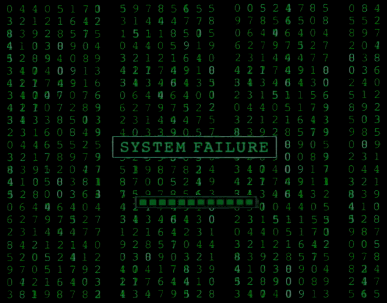

  

  

   <b style="font-size: 24px;">Cyber Security Analyst - Computer Programmer - Software & Website Developer</b>

## 👾 About 

- 🎓 B.S. Software Engineering @ WGU
- 🧠 Always Challenging Myself To Learn Everything Tech
- 🔒 Working Towards Further Pursuing My Career In Cyber Security/Data Analysis 
- 👩‍💻 Proficient In Various Programming Languages & Tools

## 🛠 Skills

### Cyber Security
- Network Security - Wireshark (Advanced), Nmap (Intermediate), Suricata (Intermediate), Tcpdump (Intermediate)
- Security Information and Event Management (SIEM) - Splunk (Intermediate), ELK Stack (Basic)
- Cloud Security - AWS Security Services (Basic), Azure Security Center (Basic)
- Vulnerability Assessment - Nessus (Basic), OpenVAS (Basic)
- Security Automation - Python Scripting For Security Tasks
- Log Analysis - Google Chronicle (Basic)
  
### Data Analysis
- Data Wrangling - Pandas, NumPy
- Statistical Analysis - SciPy, Statsmodels
- Machine Learning - Scikit-learn, TensorFlow (Basic), Keras (Basic)
- Data Visualization - Matplotlib, Seaborn, Tableau, Power BI
- Databases - SQL, MySQL, PostgreSQL, MongoDB (Basic)

### Programming
- Languages - Python (Advanced), JavaScript (Advanced), Java (Intermediate), C++ (Intermediate), Go (Basic), Rust (Basic)
- Frameworks & Libraries - React (Advanced), Angular (Intermediate), Node.js (Intermediate), Django (Intermediate), Flask (Intermediate), Pandas (Intermediate), NumPy (Intermediate), Scikit-learn (Intermediate)
- Markup Languages - HTML (Advanced), CSS (Advanced), XML (Intermediate), JSON (Intermediate)
- Database Interaction - SQL (Advanced), NoSQL (MongoDB, Basic)

### Software Applications
- Development Tools - Docker (Intermediate), Git (Advanced), Jenkins (Intermediate), VS Code (Advanced)
- Virtualization & Containerization - VirtualBox (Intermediate), VMware (Intermediate)
- Network Tools - PuTTY (Intermediate), Wireshark (Advanced)
- Data Visualization - Tableau (Intermediate), Power BI (Intermediate)
- Cloud Platforms - AWS (Basic), Azure (Basic), Google Cloud Platform (Basic)

### Website Development
- Front-End - HTML5, CSS3, JavaScript (ES6+), React, Angular, Vue.js (Basic)
- Back-End - Node.js, Express.js, Django, Flask, PHP
- Content Management Systems (CMS) - WordPress (Intermediate), Drupal (Basic)
- Version Control - Git, GitHub/GitLab
- Web Servers - Apache, Nginx

### Key Improvements
- Categorization - Maintained Clear Categories For Easy Readability.
- Relevance - Emphasized Tools And Technologies Directly Related To Your Specified Areas.
- Depth - Provided A Mix Of Advanced, Intermediate, And Basic Skills To Showcase A Well-Rounded Profile.
- Modern Tools - Included Up-To-Date Technologies Like Docker, Cloud Platforms, And Modern JavaScript Frameworks.
- Balance - Maintained A Balance Between Development, Data, And Security Skills.

## 📫 Contact

[H4ck3rByt3s Profile](https://h4ck3rByt3s.systeme.io/profile)
  
