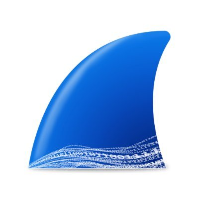

  

  

<h2 align="center">
   Cyber Security Analyst - Computer Programmer - Software & Website Developer
</h2>

## 👾 About

🎓 B.S. In Software Engineering @ WGU

🛡️ Graduate Of Google's Cybersecurity Professional Certificate (Coursera)

🔖 Holder Of 54+ Certifications (Courses & Capstone Projects)

🧠 Passionate About Continuous Learning And Solving Real-World Problems

🔒 Actively Pursuing A Career In Software Engineering, Cybersecurity, Web Development And AI

👨‍💻 Proficient In Multiple Programming Languages, Frameworks, And Tools

## 📜 Certifications & [Verification](https://drive.google.com/drive/folders/1LS1OOaF6PA33uxKgK3WIWN73c1YzJ4LE?usp=drive_link) 

🔐 Cybersecurity + AI & Generative AI (Google, Coursera, IBM, OpenAI)

 

🧑‍💻 Python & Data Science

 

🛠️ Web Development / Programming

 

📊 Business, Marketing & Tools

 

☁️ AWS & Cloud Certifications

 

## Technologies & Languages 

  
  
  
  
  
  
  
  
  
  
  
  
  
  
  

## Programs That I Use 

  
  
  
  
  
  
  
  
  
  
  
  
  

## 🛠 Skills

### Cyber Security
- Network Security - Wireshark (Advanced), Nmap (Intermediate), Suricata (Intermediate), Tcpdump (Intermediate)
- Security Information And Event Management (SIEM) - Splunk (Intermediate), ELK Stack (Basic)
- Cloud Security - AWS Security Services (Basic), Azure Security Center (Basic)
- Vulnerability Assessment - Nessus (Basic), OpenVAS (Basic)
- Security Automation - Python Scripting For Security Tasks
- Log Analysis - Google Chronicle (Basic)
  
### Data Analysis
- Data Wrangling - Pandas, NumPy
- Statistical Analysis - SciPy, Statsmodels
- Machine Learning - Scikit-learn, TensorFlow (Basic), Keras (Basic)
- Data Visualization - Matplotlib, Seaborn, Tableau, Power BI
- Databases - SQL, MySQL, PostgreSQL, MongoDB (Basic)

### Programming
- Languages - Python (Advanced), JavaScript (Advanced), Java (Intermediate), C++ (Intermediate), Go (Basic), Rust (Basic)
- Frameworks & Libraries - React (Advanced), Angular (Intermediate), Node.js (Intermediate), Django (Intermediate), Flask (Intermediate), Pandas (Intermediate), NumPy (Intermediate), Scikit-learn (Intermediate)
- Markup Languages - HTML (Advanced), CSS (Advanced), XML (Intermediate), JSON (Intermediate)
- Database Interaction - SQL (Advanced), NoSQL (MongoDB, Basic)

### Software Applications
- Development Tools - Docker (Intermediate), Git (Advanced), Jenkins (Intermediate), VS Code (Advanced)
- Virtualization & Containerization - VirtualBox (Intermediate), VMware (Intermediate)
- Network Tools - PuTTY (Intermediate), Wireshark (Advanced)
- Data Visualization - Tableau (Intermediate), Power BI (Intermediate)
- Cloud Platforms - AWS (Basic), Azure (Basic), Google Cloud Platform (Basic)

### Website Development
- Front-End - HTML5, CSS3, JavaScript (ES6+), React, Angular, Vue.js (Basic)
- Back-End - Node.js, Express.js, Django, Flask, PHP
- Content Management Systems (CMS) - WordPress (Intermediate), Drupal (Basic)
- Version Control - Git, GitHub/GitLab
- Web Servers - Apache, Nginx

### Key Improvements
- Categorization - Maintained Clear Categories For Easy Readability.
- Relevance - Emphasized Tools And Technologies Directly Related To Your Specified Areas.
- Depth - Provided A Mix Of Advanced, Intermediate, And Basic Skills To Showcase A Well-Rounded Profile.
- Modern Tools - Included Up-To-Date Technologies Like Docker, Cloud Platforms, And Modern JavaScript Frameworks.
- Balance - Maintained A Balance Between Development, Data, And Security Skills.

## 📊 My GitHub Stats

  <!-- Profile Views -->
  

   
  <!-- Profile Stats -->
  

   
  <!-- Streak Stats -->
  

   
  <!-- Top Languages -->
  

## 🏆 GitHub Profile Trophy

  

## 📫 Contact

Personal  
[H4ck3rByt3s Profile](https://h4ck3rbyt3s.systeme.io/profile) 

Professional  
[Decrypt Mike LinkedIn](https://www.linkedin.com/in/h4ck3rbyt3s) 

## 📄 License

This repository is licensed under the (**Default Copyright Law**) which prohibits the redistribution or reuse of its content.

   
   
   
   
   

