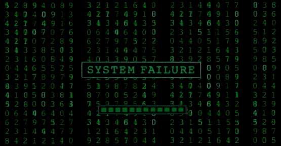
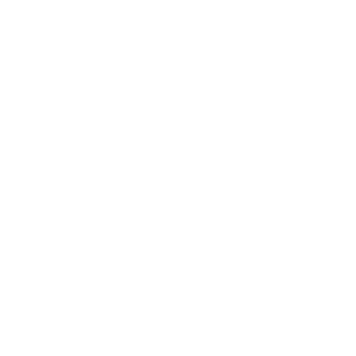
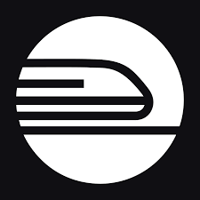
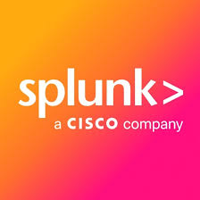

  

<p align="center">
  
</p>

<p align="center">
  
</p>

[](https://git.io/typing-svg)

## 👾 About

```yaml
🎓 Education      : B.S. In Software Engineering @ WGU

🛡️ Certification  : Graduate Of Google's Cybersecurity Professional Certificate (Coursera)

📜 Achievements   : Holder Of 50+ Certifications (Courses & Capstone Projects)

🧠 Passion        : Continuous Learning & Solving Real-World Problems

🔒 Career Focus   : Cybersecurity • Computer Programmer • Website/Software Development • AI/ML Engineer 

👨‍💻 Proficiency    : Multiple Programming Languages, Frameworks, And Tools
   -------------------------------------------------------------------------------------------
📅 2025 Goals     : ◻️ Master A Framework Or Ecosystem  ◻️ Contribute To 5 Open Source Projects
                    ◻️ Create My Own 🧱 🔗 Network      ✓ Strengthen My DevOps & CI/CD Skills

```

## 📜 Certifications & [Verification](https://drive.google.com/drive/folders/1LS1OOaF6PA33uxKgK3WIWN73c1YzJ4LE?usp=drive_link) 

<details>
<summary><strong>🛡️ Cybersecurity</strong></summary><br/>


</details>

<details>
<summary><strong>🤖 AI & Generative AI</strong></summary><br/>


</details>

<details>
<summary><strong>🧑‍💻 Python & Data Science</strong></summary><br/>


-3b82f6?style=flat-square&logo=hackerrank&logoColor=white&labelColor=555)
-3b82f6?style=flat-square&logo=hackerrank&logoColor=white&labelColor=555)
-3b82f6?style=flat-square&logo=hackerrank&logoColor=white&labelColor=555)
-3b82f6?style=flat-square&logo=hackerrank&logoColor=white&labelColor=555)


</details>

<details>
<summary><strong>🛠️ Web Development & Programming</strong></summary><br/>


-8b5cf6?style=flat-square&logo=hackerrank&logoColor=white&labelColor=555)
-8b5cf6?style=flat-square&logo=hackerrank&logoColor=white&labelColor=555)
-8b5cf6?style=flat-square&logo=hackerrank&logoColor=white&labelColor=555)
-8b5cf6?style=flat-square&logo=hackerrank&logoColor=white&labelColor=555)
-8b5cf6?style=flat-square&logo=hackerrank&logoColor=white&labelColor=555)
-8b5cf6?style=flat-square&logo=hackerrank&logoColor=white&labelColor=555)
-8b5cf6?style=flat-square&logo=hackerrank&logoColor=white&labelColor=555)
-8b5cf6?style=flat-square&logo=hackerrank&logoColor=white&labelColor=555)
-8b5cf6?style=flat-square&logo=hackerrank&logoColor=white&labelColor=555)
-8b5cf6?style=flat-square&logo=hackerrank&logoColor=white&labelColor=555)


</details>

<details>
<summary><strong>📊 Business, Marketing & Tools</strong></summary><br/>


</details>

<details>
<summary><strong>☁️ AWS & Cloud</strong></summary><br/>


</details>

## 📌 Top Repos

<p align="center">
  <a href="https://github.com/DecryptMike/DecryptMike-Log-Analyzer">
    
  </a>
  &nbsp;&nbsp;
  <a href="https://github.com/DecryptMike/DecryptMike-AI-Backend">
    
    </a>
</p>

<p align="center"> 
  <a href="https://github.com/DecryptMike/DecryptMike-SaaS-Starter-Kit">
    
  </a>
  &nbsp;&nbsp; 
  <a href="https://github.com/DecryptMike/DecryptMike-SecureFileTransfer">
    
  </a>
</p>


## 🔧 My Services 

<a href="https://h4ck3rbyt3s.systeme.io/websitepackage"></a><br>Custom Web Builds For Personal Or Business

<a href="https://app.usebraintrust.com/r/mike1420/"></a><br>1 On 1 Mentorship • Resume Help • Portfolio Review • Start Up Tech Projects

## Technologies & Languages 

<p align="center">
  
  
  
  
  
  
  
  
  
  
  
  
  
  <br>
  
  
  
  
  
  
  
  
  
  
  
  
  
  <br>
  
  
</p>

## Programs That I Use 

<p align="center">
  
  
  
  
  
  
  
  
  
  
  
  
  
  <br>
  
  
  
</p>

## 🛠 Skills

<details>
<summary><strong>🛡️ Cybersecurity</strong></summary>
  
- Network Security - Wireshark (Advanced), Nmap (Intermediate), Suricata (Intermediate), Tcpdump (Intermediate)

- Security Information And Event Management (SIEM) - Splunk (Intermediate), ELK Stack (Basic)

- Cloud Security - AWS Security Services (Basic), Azure Security Center (Basic)

- Vulnerability Assessment - Nessus (Basic), OpenVAS (Basic)

- Security Automation - Python Scripting For Security Tasks

- Log Analysis - Google Chronicle (Basic)

</details>

<details>
<summary><strong>📈 Data Analysis</strong></summary>

- Data Wrangling - Pandas, NumPy

- Statistical Analysis - SciPy, Statsmodels

- Machine Learning - Scikit-learn, TensorFlow (Basic), Keras (Basic)

- Data Visualization - Matplotlib, Seaborn, Tableau, Power BI

- Databases - SQL, MySQL, PostgreSQL, MongoDB (Basic)

</details>

<details>
<summary><strong>⚙️ Programming</strong></summary>

- Languages - Python (Advanced), JavaScript (Advanced), Java (Intermediate), C++ (Intermediate), Go (Basic), Rust (Basic)

- Frameworks & Libraries - React (Advanced), Angular (Intermediate), Node.js (Intermediate), Django (Intermediate)
                           Flask (Intermediate), Pandas (Intermediate), NumPy (Intermediate), Scikit-learn (Intermediate)

- Markup Languages - HTML (Advanced), CSS (Advanced), XML (Intermediate), JSON (Intermediate)

- Database Interaction - SQL (Advanced), NoSQL (MongoDB Basic)

</details>

<details>
<summary><strong>🖥️ Software Applications</strong></summary>

- Development Tools - Docker (Intermediate), Git (Advanced), Jenkins (Intermediate), VS Code (Advanced)

- Virtualization & Containerization - VirtualBox (Intermediate), VMware (Intermediate)

- Network Tools - PuTTY (Intermediate), Wireshark (Advanced)

- Data Visualization - Tableau (Intermediate), Power BI (Intermediate)

- Cloud Platforms - AWS (Basic), Azure (Basic), Google Cloud Platform (Basic)

</details>

<details>
<summary><strong>🌐 Website Development</strong></summary>

- Front-End - HTML5, CSS3, JavaScript (ES6+), React, Angular, Vue.js (Basic)

- Back-End - Node.js, Express.js, Django, Flask, PHP

- Content Management Systems (CMS) - WordPress (Intermediate), Drupal (Basic)

- Version Control - Git, GitHub/GitLab

- Web Servers - Apache, Nginx

</details>

<details>
<summary><strong>✅ Key Improvements</strong></summary>

- Categorization - Maintained Clear Categories For Easy Readability
  
- Relevance - Emphasized Tools And Technologies Directly Related To My Specified Areas
  
- Depth - Provided A Mix Of Advanced, Intermediate, And Basic Skills To Showcase My Well-Rounded Expertise
  
- Modern Tools - Included My Up-To-Date Technologies Like Docker, Cloud Platforms, & Modern JavaScript Frameworks
  
- Balance - Showcasing My Balance Between Development, Data, And Security Skills

</details>

## 💬 Motivation
<div align="center">
  
</div>

## 🏆 Trophies

<p align="center">
  
</p>

## 📊 Stats
<p align="center">
  
  
  
  
  
</p>

## 🐍 Contribution Snake

<p align="center">
  
</p>

## 📫 Contact

<a href="https://www.linkedin.com/in/h4ck3rbyt3s"></a><br>
Professional

<a href="https://h4ck3rbyt3s.systeme.io/profile"></a><br>
Personal

## 📄 License

This repository is licensed under the (**Default Copyright Law**) which prohibits the redistribution or reuse of its content.
<br>
<br>

<p align="center">
   
   

   
   
   
</p>
